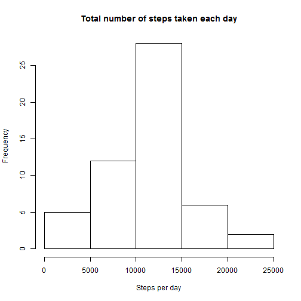
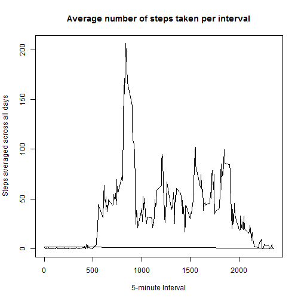
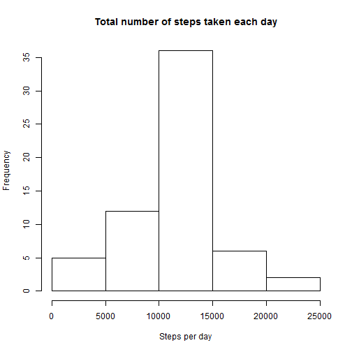
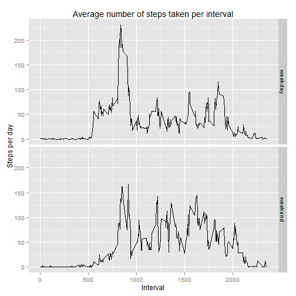

### Loading and processing the data
Show any code that is needed to

1. Load the data

```r
library(dplyr)
library(ggplot2)
setwd("C:\\Users\\Jesse\\Documents\\Coursera\\Reproducible Research\\RepData_PeerAssessment1")
activity <- tbl_df(read.csv(unz("activity.zip", "activity.csv"), header = TRUE))
```

2. Process/transform the data into a format suitable for your analysis

```r
activity$avgsteps <- tapply(activity$steps, activity$interval, FUN = mean, na.rm = TRUE)
activity$original <- complete.cases(activity)
```

### What is mean total number of steps taken per day?
For this part of the assignment, the missing values in the dataset were ignored.

1. Calculate the total number of steps taken per day

```r
stepsDay <- aggregate(activity$steps, list(date=activity$date), FUN=sum)
stepsDay
```

```
##          date     x
## 1  2012-10-01    NA
## 2  2012-10-02   126
## 3  2012-10-03 11352
## 4  2012-10-04 12116
## 5  2012-10-05 13294
## 6  2012-10-06 15420
## 7  2012-10-07 11015
## 8  2012-10-08    NA
## 9  2012-10-09 12811
## 10 2012-10-10  9900
## 11 2012-10-11 10304
## 12 2012-10-12 17382
## 13 2012-10-13 12426
## 14 2012-10-14 15098
## 15 2012-10-15 10139
## 16 2012-10-16 15084
## 17 2012-10-17 13452
## 18 2012-10-18 10056
## 19 2012-10-19 11829
## 20 2012-10-20 10395
## 21 2012-10-21  8821
## 22 2012-10-22 13460
## 23 2012-10-23  8918
## 24 2012-10-24  8355
## 25 2012-10-25  2492
## 26 2012-10-26  6778
## 27 2012-10-27 10119
## 28 2012-10-28 11458
## 29 2012-10-29  5018
## 30 2012-10-30  9819
## 31 2012-10-31 15414
## 32 2012-11-01    NA
## 33 2012-11-02 10600
## 34 2012-11-03 10571
## 35 2012-11-04    NA
## 36 2012-11-05 10439
## 37 2012-11-06  8334
## 38 2012-11-07 12883
## 39 2012-11-08  3219
## 40 2012-11-09    NA
## 41 2012-11-10    NA
## 42 2012-11-11 12608
## 43 2012-11-12 10765
## 44 2012-11-13  7336
## 45 2012-11-14    NA
## 46 2012-11-15    41
## 47 2012-11-16  5441
## 48 2012-11-17 14339
## 49 2012-11-18 15110
## 50 2012-11-19  8841
## 51 2012-11-20  4472
## 52 2012-11-21 12787
## 53 2012-11-22 20427
## 54 2012-11-23 21194
## 55 2012-11-24 14478
## 56 2012-11-25 11834
## 57 2012-11-26 11162
## 58 2012-11-27 13646
## 59 2012-11-28 10183
## 60 2012-11-29  7047
## 61 2012-11-30    NA
```

2. If you do not understand the difference between a histogram and a barplot, research the difference between them. Make a histogram of the total number of steps taken each day

```r
hist(stepsDay$x, 
     main = "Total number of steps taken each day",
     xlab = "Steps per day")
```

 

3. Calculate and report the mean and median total number of steps taken per day

```r
summary(stepsDay$x)
```

```
##    Min. 1st Qu.  Median    Mean 3rd Qu.    Max.    NA's 
##      41    8841   10760   10770   13290   21190       8
```

### What is the average daily activity pattern?

1. Make a time series plot (i.e. type = "l") of the 5-minute interval (x-axis) and the average number of steps taken, averaged across all days (y-axis)

```r
plot(activity$interval, activity$avgsteps,
     main = "Average number of steps taken per interval",
     xlab = "5-minute Interval",
     ylab = "Steps averaged across all days",
     type = "l")
```

 

2. Which 5-minute interval, on average across all the days in the dataset, contains the maximum number of steps?

```r
maxSteps <- aggregate(activity$steps, list(interval=activity$interval), FUN=mean, na.rm = TRUE)
maxSteps$interval[which.max(maxSteps$x)]
```

```
## [1] 835
```

### Imputing missing values
Note that there are a number of days/intervals where there are missing values (coded as NA). The presence of missing days may introduce bias into some calculations or summaries of the data.

1. Calculate and report the total number of missing values in the dataset (i.e. the total number of rows with NAs)

```r
sum(!activity$original)
```

```
## [1] 2304
```

2. Devise a strategy for filling in all of the missing values in the dataset. The strategy does not need to be sophisticated. For example, you could use the mean/median for that day, or the mean for that 5-minute interval, etc.
- First create a new dataset
- Split the dataset into two lists, one for TRUE and one for FALSE
- Fill in the average steps per interval instead of every NA

```r
newActivity <- activity
splitByOriginal <- split(newActivity, newActivity$original, drop = TRUE)
for (row in 1:nrow(splitByOriginal[["FALSE"]])) {
  splitByOriginal[["FALSE"]]$steps <- round(splitByOriginal[["FALSE"]]$avgsteps, digits = 2)
}
```

3. Create a new dataset that is equal to the original dataset but with the missing data filled in.

```r
newActivity <- rbind(splitByOriginal[["FALSE"]], splitByOriginal[["TRUE"]])
newActivity <- newActivity[with(newActivity, order(date, interval)), ]
```

4. Make a histogram of the total number of steps taken each day and Calculate and report the mean and median total number of steps taken per day. Do these values differ from the estimates from the first part of the assignment? What is the impact of imputing missing data on the estimates of the total daily number of steps?

```r
newStepsDay <- aggregate(newActivity$steps, list(date=newActivity$date), FUN=sum)
hist(newStepsDay$x, 
     main = "Total number of steps taken each day",
     xlab = "Steps per day")
```

 

```r
summary(newStepsDay$x)
```

```
##    Min. 1st Qu.  Median    Mean 3rd Qu.    Max. 
##      41    9819   10770   10770   12810   21190
```
- The total daily number of steps will be higher, because we filled in averages per interval that had NA. Before, these values would not be taken into account and now they are. The mean wil stay the same, the median will be closer to the mean, and the total daily number of steps will be higher.

### Are there differences in activity patterns between weekdays and weekends?
For this part the weekdays() function may be of some help here. Use the dataset with the filled-in missing values for this part.

1. Create a new factor variable in the dataset with two levels -- "weekday" and "weekend" indicating whether a given date is a weekday or weekend day.

```r
newActivity$date <- as.Date(strptime(newActivity$date, format = "%Y-%m-%d"))
newActivity$day <- weekdays(newActivity$date)

for(i in 1:nrow(newActivity)) {
  if (newActivity[i, ]$day %in% c("Saturday", "Sunday")) {
    newActivity[i, ]$day <- "weekend"
  }
  else {
    newActivity[i, ]$day <- "weekday"
  }
}

newActivity$day <- as.factor(newActivity$day)
```

2. Make a panel plot containing a time series plot (i.e. type = "l") of the 5-minute interval (x-axis) and the average number of steps taken, averaged across all weekday days or weekend days (y-axis).

```r
newStepsDay <- aggregate(newActivity$steps, 
                         list(interval=newActivity$interval, 
                         day=newActivity$day), 
                         FUN=mean)

ggplot(data = newStepsDay, aes(interval, x)) + 
  geom_line() + 
  facet_grid(day ~ .) +
  ggtitle("Average number of steps taken per interval") +
  xlab("Interval") +
  ylab("Steps per day")
```

 
